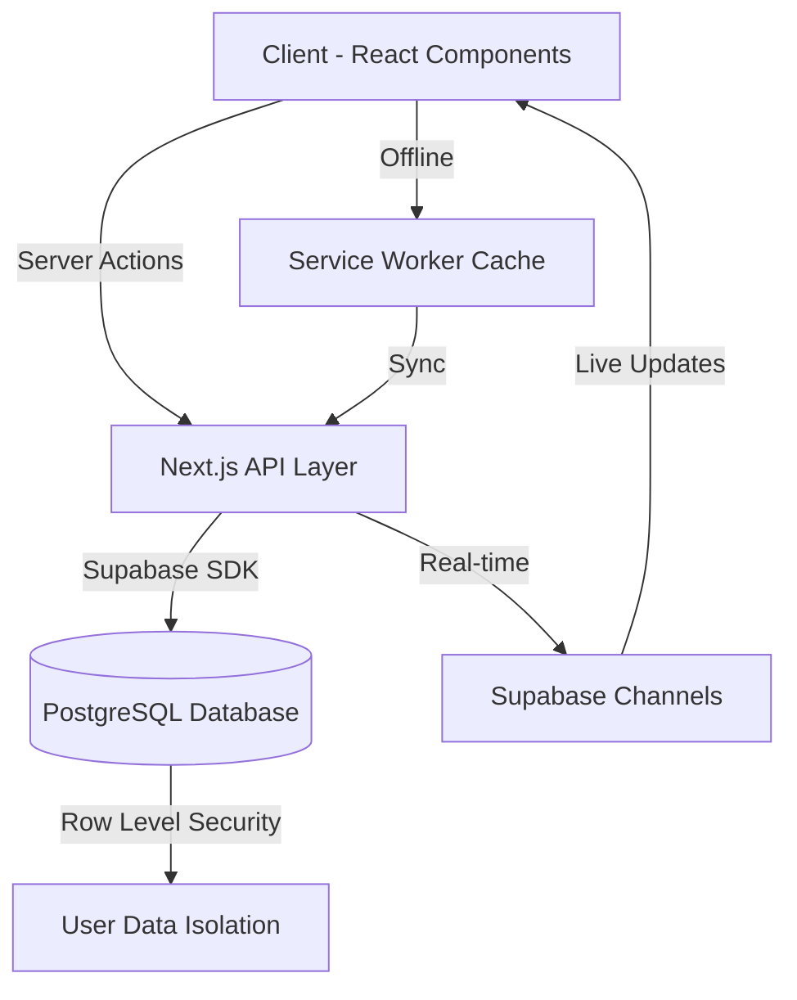

<div align="center">

# 💰 Donations Manager

### *Elegant Financial Tracking for Charitable Giving*

[](https://nextjs.org/)
[](https://www.typescriptlang.org/)
[](https://tailwindcss.com/)
[](https://supabase.com/)
[](https://web.dev/progressive-web-apps/)

---

> **A beautifully crafted, mobile-first Progressive Web App for managing donations, tracking expenses, and visualizing financial goals with stunning analytics.**

</div>

---

## ✨ Features

<table>
<tr>
<td width="50%">

### 📊 Real-Time Analytics
Interactive charts and visualizations powered by Recharts. Track income vs. expenses, view monthly trends, and monitor goal progress with beautiful circular indicators.

</td>
<td width="50%">

### 🗂️ Multi-Category Management
Organize donations across multiple categories (tabs). Create, rename, and delete categories with intuitive gestures—long-press to edit on mobile!

</td>
</tr>
<tr>
<td width="50%">

### 📱 PWA & Offline Support
Install as a native app on any device. Works seamlessly offline with automatic sync when back online. Designed mobile-first with smooth 60fps animations.

</td>
<td width="50%">

### 🎯 Financial Goal Tracking
Set savings goals per category and visualize your progress. Real-time updates show how much you've collected and what remains.

</td>
</tr>
<tr>
<td width="50%">

### 📥 Export & Reports
Download comprehensive CSV reports with full transaction history, summaries, and metadata. Perfect for record-keeping and audits.

</td>
<td width="50%">

### 🔐 Secure Authentication
Multi-user support with Supabase Auth. Each user has their own isolated data with Row Level Security (RLS) protection.

</td>
</tr>
</table>

---

## 🖼️ Screenshots

<div align="center">

| Dashboard | Analytics | Transactions |
|:---------:|:---------:|:------------:|
|  |  |  |

</div>

---

## 🛠️ Tech Stack

<table>
<tr>
<td valign="top" width="33%">

### Frontend
- **Next.js 16.1** - React Framework
- **React 19** - UI Library
- **TypeScript 5** - Type Safety
- **Tailwind CSS 4** - Styling
- **Radix UI** - Accessible Components
- **Lucide React** - Icon System
- **Recharts** - Data Visualization

</td>
<td valign="top" width="33%">

### Backend
- **Next.js API Routes** - Serverless Functions
- **Server Actions** - Form Handling
- **Supabase Client** - Database SDK
- **Middleware** - Auth Protection

</td>
<td valign="top" width="33%">

### Infrastructure
- **Supabase** - PostgreSQL Database
- **Supabase Auth** - Authentication
- **Row Level Security** - Data Isolation
- **PWA** - Offline Support
- **Vercel** - Deployment

</td>
</tr>
</table>

---

## 🏗️ Project Structure

```
src/
├── app/
│   ├── actions.ts          # Server actions (CRUD operations)
│   ├── globals.css         # Global styles & Tailwind config
│   ├── layout.tsx          # Root layout with PWA setup
│   ├── page.tsx            # Home page (Dashboard)
│   ├── login/              # Authentication pages
│   └── quick-add/          # Quick transaction entry
│
├── components/
│   ├── dashboard.tsx       # Main dashboard component
│   ├── statistics-view.tsx # Analytics & charts
│   ├── transaction-list.tsx# Transaction CRUD UI
│   └── ui/                 # Reusable UI components
│
├── lib/
│   ├── supabase.ts         # Supabase client config
│   └── utils.ts            # Utility functions
│
└── middleware.ts           # Auth middleware
```

---

## 🚀 Getting Started

<details>
<summary><b>📋 Prerequisites</b></summary>

- **Node.js** 18.0 or higher
- **npm** or **pnpm**
- **Supabase** account (free tier works!)

</details>

### 1️⃣ Clone the Repository

```bash
git clone https://github.com/ahmedmostafa8/Donations.git
cd Donations
```

### 2️⃣ Install Dependencies

```bash
npm install
```

### 3️⃣ Configure Environment Variables

Create a `.env.local` file in the root directory:

```env
# Supabase Configuration
NEXT_PUBLIC_SUPABASE_URL=your_supabase_project_url
NEXT_PUBLIC_SUPABASE_ANON_KEY=your_supabase_anon_key
```

### 4️⃣ Set Up Database

Run the SQL scripts in your Supabase SQL Editor:

```sql
-- 1. Create tables
-- See: supabase_setup.sql

-- 2. Enable Row Level Security
-- See: supabase_rls.sql
```

### 5️⃣ Start Development Server

```bash
npm run dev
```

Open [http://localhost:3000](http://localhost:3000) to see your app! 🎉

---

## 📊 Data Flow Architecture



---

## 🗺️ Roadmap

- [x] Multi-category donation tracking
- [x] Real-time analytics with charts
- [x] PWA with offline support
- [x] CSV export functionality
- [x] Goal tracking per category
- [ ] **Dark mode theme**
- [ ] **WhatsApp integration for notifications**
- [ ] **Recurring donation reminders**
- [ ] **Multi-currency support**
- [ ] **PDF report generation**

---

## 🤝 Contributing

Contributions are welcome! Feel free to:

1. Fork the repository
2. Create a feature branch (`git checkout -b feature/amazing-feature`)
3. Commit your changes (`git commit -m 'Add amazing feature'`)
4. Push to the branch (`git push origin feature/amazing-feature`)
5. Open a Pull Request

---

## 📄 License

This project is licensed under the **MIT License** - see the [LICENSE](LICENSE) file for details.

---

<div align="center">

**Built with ❤️ for charitable giving**

[⬆ Back to Top](#-donations-manager)

</div>
